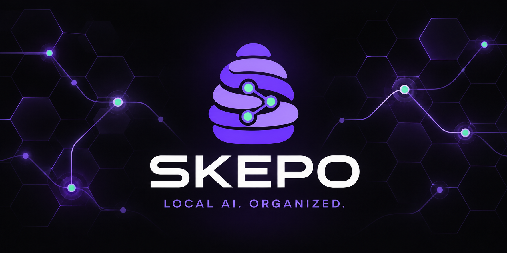
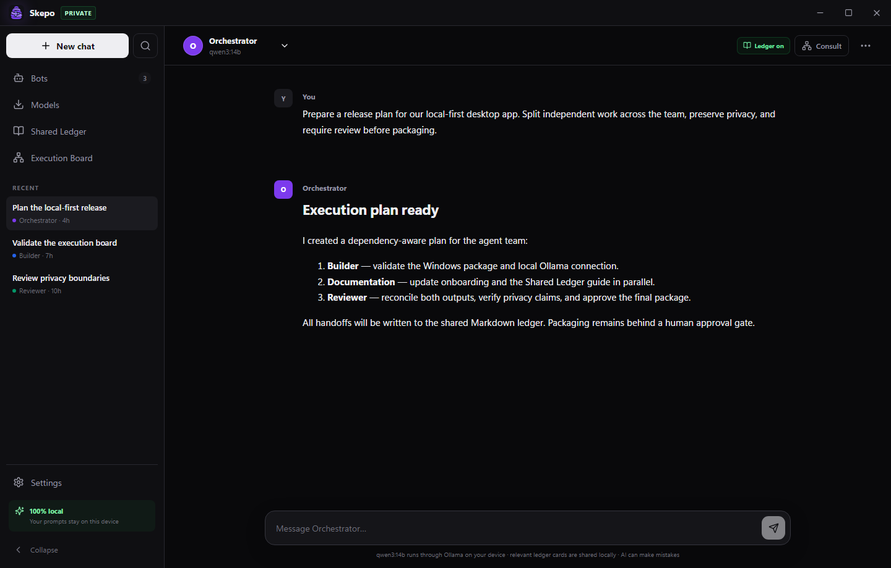

<p align="center">
  
</p>

<p align="center">
  <strong>A private Windows workspace where local AI agents plan, collaborate, and execute through Ollama.</strong>
</p>

<p align="center">
  <a href="LICENSE"></a>
  
  
  
</p>

<p align="center">
  
</p>

## Local agents that can actually work together

Skepo is an open-source Windows desktop application for building private AI agent teams with models installed through [Ollama](https://ollama.com/). It combines familiar chat, portable agent profiles, durable shared memory, and a safety-first autonomous execution board—without requiring a cloud account or hosted vector database.

Your prompts, conversations, work cards, task manifests, and bot definitions remain on hardware you control.

| Capability | What it provides |
|---|---|
| **Agent studio** | Create specialized agents with individual models, system prompts, context windows, and generation controls. |
| **Shared Ledger** | Compact Markdown work cards let agents learn what teammates completed without replaying entire conversations. |
| **Execution Board** | A broker creates a dependency graph, independent workers run in parallel, typed gates verify progress, and a reviewer reconciles the result. |
| **Instant starter team** | The first installed Ollama model automatically powers Broker, Researcher, Builder, and Reviewer roles. |
| **Human control** | Plan approval, risky-action checkpoints, pause, cancel, retry, leases, and strict token/time budgets. |
| **Local model management** | Discover, download, inspect, and remove Ollama models directly from the desktop interface. |
| **Inspectable by design** | Workflows are ordinary JSON and Markdown files that can be reviewed, backed up, or committed to Git. |

## Why Skepo is different

- **No agent chatter loop.** Agents exchange compact, durable work cards and request a direct consultation only when needed.
- **No opaque memory database.** Relevant cards are selected locally using visible lexical scoring, recency, and cross-agent value.
- **No pretend autonomy.** The orchestrator uses an explicit dependency graph with application-enforced states and budgets.
- **No silent collisions.** Task leases prevent two agents from claiming the same work, while reviewer synthesis handles conflicting results.
- **No mandatory cloud.** Skepo works end-to-end through Ollama; optional Jev gates can be enabled with your own TypeSafe key.

Skepo adopts the useful harness principles demonstrated by [JCode](https://github.com/1jehuang/jcode)—automatic relevant-memory recall, visible agent activity, lightweight concurrent sessions, and conflict-aware coordination—while implementing them independently for a Windows-first Ollama team and a portable Markdown execution ledger.

## Quick start

### Requirements

- Windows 10 or 11
- [Ollama for Windows](https://ollama.com/download/windows)
- At least one downloaded Ollama model

Start Ollama and open Skepo. Skepo detects the first installed model and creates a ready-to-run four-agent team automatically. Choose a workspace folder under **Shared Ledger** to enable durable team memory and autonomous runs.

### Build from source

Development requires Node.js 20+ and pnpm.

```powershell
git clone https://github.com/karthikmeduri/skepo.git
cd skepo
pnpm install
pnpm dev
```

Create the Windows installer with:

```powershell
pnpm build
```

The NSIS installer is written to `release/Skepo-Setup-0.5.0.exe`.

## Shared Ledger

Skepo creates a `.skepo-ledger` directory inside the workspace folder selected by the user:

```text
.skepo-ledger/
├── INDEX.md
├── workspace.json
├── bots.json
├── bots/
│   └── <agent>/
│       ├── CURRENT.md
│       └── journal/*.md
├── handoffs/*.md
└── sessions/
    └── <session-id>/
        ├── manifest.json
        ├── STATE.md
        ├── decisions.md
        └── tasks/*.md
```

Only a configurable number of relevant cards enter a model's context. Existing `.localbot-ledger` workspaces from pre-0.4 releases remain supported.

Read the [Shared Ledger architecture](docs/SHARED_LEDGER.md) for the protocol, trust model, and roadmap.

## Autonomous execution

The Execution Board asks a broker agent for a bounded task graph, validates and normalizes that graph in application code, and runs only tasks whose dependencies are complete. Independent tasks may run concurrently within the configured limit.

Every run includes:

- Atomic, revisioned manifests and task files
- Time-limited task leases
- Token, task, retry, time, and parallelism budgets
- Approval gates for plans and risky actions
- Failure, blocked, paused, cancelled, and recovery states
- Final synthesis by a designated reviewer agent
- Typed plan and result decisions with confidence and provider provenance

Models propose work; Skepo owns the workflow state machine.

## Decision engine

Skepo separates generative work from bounded decisions. Ollama agents still plan, research, build, and review. A lightweight decision layer answers only closed questions such as whether a plan may proceed or a worker result should be accepted, retried, or reviewed.

- **Auto** uses Jev when a key is configured and falls back locally.
- **Local only** uses deterministic, zero-token gates with no network request.
- **Prefer Jev** requests TypeSafe AI's `jev-latest` model and safely falls back if it is unavailable.

Jev is optional. Its API key is encrypted through Windows credential protection and is never written to a workspace, manifest, log, or Git. When Jev is active, the relevant plan or task result is sent to TypeSafe AI; the UI states this before configuration.

## Privacy and security

Skepo includes no telemetry, remote fonts, or advertising SDK. By default, requests are sent only to the configured Ollama URL. If you explicitly configure Jev, bounded workflow state is also sent to TypeSafe AI for typed decisions. If either endpoint points to another computer, the corresponding request travels to that computer.

The Electron renderer uses context isolation, sandboxing, a narrow IPC bridge, and local atomic persistence. Shared Ledger files are written only beneath the workspace folder explicitly selected by the user.

## Contributing

Issues and focused pull requests are welcome. See [CONTRIBUTING.md](CONTRIBUTING.md) before submitting changes.

## License

Skepo is available under the [MIT License](LICENSE).
